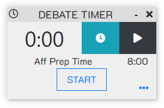
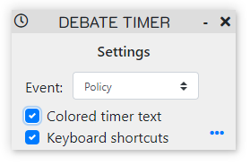

# Debate Timer
A smooth digital timer with beautiful UI for competitive debate.

## Features
- Timers for several types of debate
  - HS Policy
  - College Policy
  - Public Forum
  - Lincoln Douglas
 - Timer color interpolates with time remaining
 - Keyboard shortcuts to start and pause/resume timers

## How to use
1. Download [debate-timer-setup-1.0.0.exe](https://github.com/Matrix4f/DebateTimer/releases/download/1.0.0/debate-timer-setup-1.0.0.exe) from the Releases page
2. Run the installer - this will install Debate Timer and then launch the app
3. Pin the app to the taskbar by right-clicking the app icon on the taskbar and selecting "Pin to taskbar"
4. Enjoy!

#  Keyboard Shortcuts
## Global Shortcuts
These shortcuts can be used for *all* debate events!

**Pause/resume timer** - `Alt+Shift+R` - Special shortcut that doesn't require the timer window to be selected
**Aff prep** - `Shift+A` - Starts or resumes the affirmative's prep time
**Neg prep** - `Shift+N` - Starts or resumes the negative's prep time

There are also shortcuts for specific events.

## Policy Debate

**Constructive speech** - `Shift+C`

**Rebuttal speech** - `Shift+R`

**Cross-examination** - `Shift+X`

## Lincoln Douglas Debate

**1AC, 1NR, and 2AR speeches** - `Shift+R`

**1NC speech** - `Shift+C`

**Cross-examiantion** - `Shift+X`

## Public Forum Debate

**Constructive speech** - `Shift+C`

**Summary and Final Focus speeches** - `Shift+S`

**Crossfire** - `Shift+F`

# Feedback
Do not hesitate to provide me feedback and suggestions for improving this project!

Contact me either by emailing vgsoham@gmail.com or by opening an issue on this repo.

